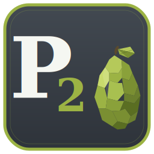

<p align="center">
  
</p>

<h1 align="center">Peer2Pear.com</h1>

<p align="center">Project website for <strong>Peer2Pear</strong> — an end-to-end encrypted peer-to-peer messaging and file sharing application built as a senior capstone project (CMP_SC 4980) at the University of Missouri - Columbia.</p>

## About

This is a static single-page website showcasing the Peer2Pear application, its architecture, cryptographic design, team, and roadmap. It serves as the public-facing landing page for the project.

## Live Site

Visit the deployed site: [peer2pear-website](https://peer2pear.com/)

## Features

- Responsive single-page design with dark theme and lime green accents
- Sections: Hero, Problem/Solution, Ethics, Features, Architecture, Security, How It Works, Testing, Team, Timeline, Roadmap, and Download CTA
- Team member photos and roles
- Mobile-friendly navigation
- Scroll animations and hover effects
- Links to the [main Peer2Pear repo](https://github.com/zjones2142/Peer2Pear) and releases

## Tech Stack

- HTML5, CSS3, vanilla JavaScript
- [DM Sans](https://fonts.google.com/specimen/DM+Sans), [DM Serif Display](https://fonts.google.com/specimen/DM+Serif+Display), and [JetBrains Mono](https://fonts.google.com/specimen/JetBrains+Mono) fonts via Google Fonts
- No build tools or frameworks required

## Running Locally

Serve the directory with any static file server:

```bash
# Using Node.js
npx serve -s .

# Using Python
python3 -m http.server 8080
```

Then open `http://localhost:8080` in your browser.

## Project Structure

```
peer2pear-website/
├── index.html       # Main page
├── style.css        # All styles
├── script.js        # Nav toggle, scroll animations
├── images/          # Team member photos
│   ├── zach.jpg
│   ├── wyatt.png
│   ├── joseph.jpg
│   └── collin.png
└── README.md
```

## Team

| Name | Role |
|------|------|
| Zach Jones | Team Lead & Protocol |
| Wyatt Kellett | Cryptography & Protocol |
| Joseph Mun | UI / UX & Qt Frontend |
| Collin Wanta | Storage & Build System |

## Related

- [Peer2Pear Application](https://github.com/zjones2142/Peer2Pear) — the main C++/Qt application repository

## License

© 2025–2026 Group Peer-To-Pear. All rights reserved.
